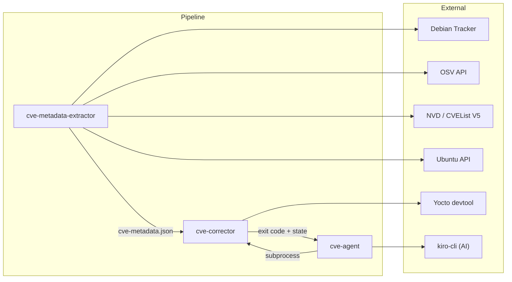
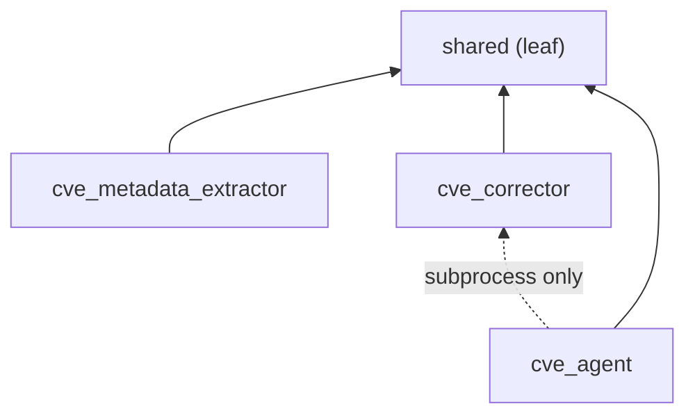
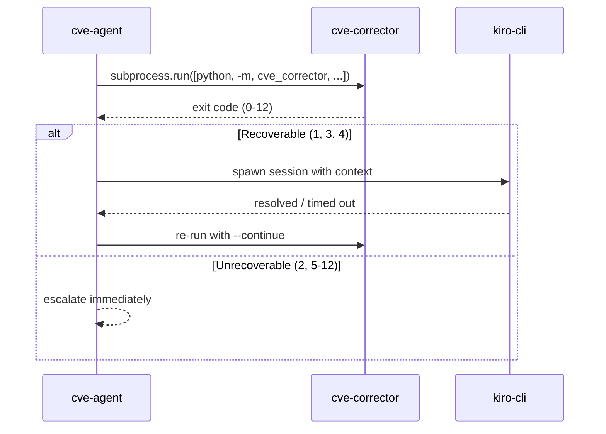
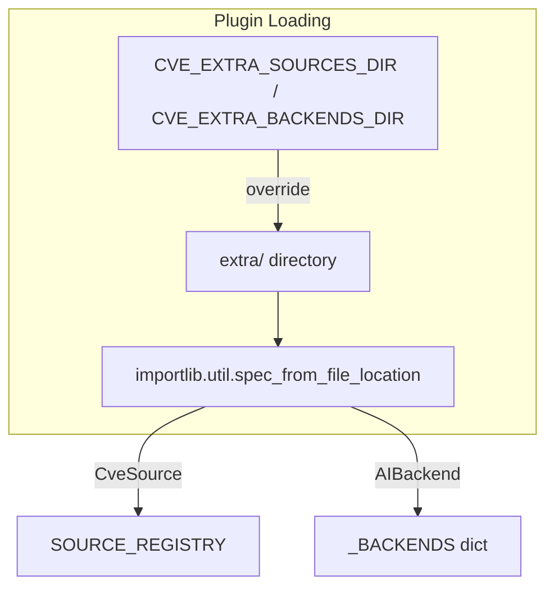
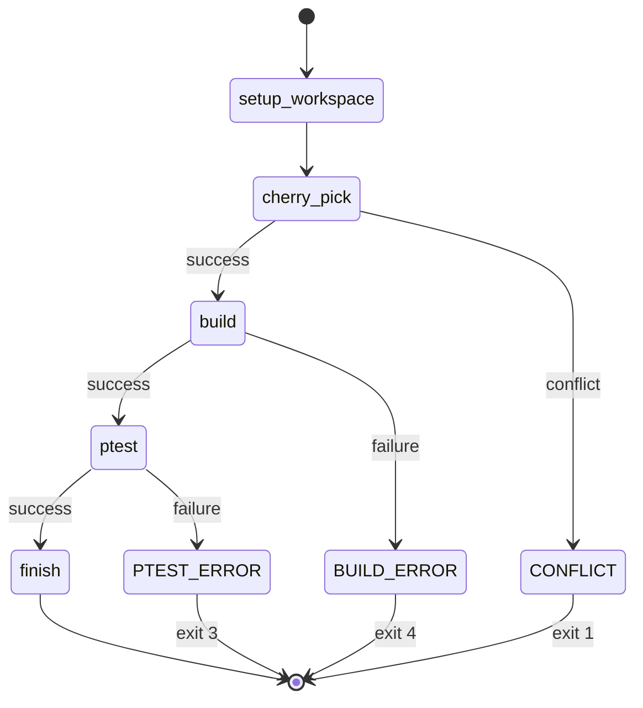
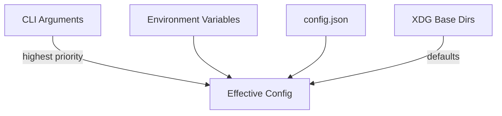

# Architecture

## System Overview

## Dependency Graph (Internal)

**Invariant**: `shared` has zero upward dependencies. No package imports from a sibling package at the Python level. The agent invokes the corrector only via `subprocess.run()`.

## Process Isolation

The agent and corrector run in separate processes:

This design ensures:
- Corrector crashes don't take down the agent
- AI sessions operate in an isolated git workspace
- State is persisted to disk between invocations (resume after interruption)

## Plugin System

Both the extractor and agent support runtime plugin discovery:

**Security controls**:
- Directory must be owned by current user (`st_uid == os.getuid()`)
- Directory must not be world-writable (`st_mode & 0o002 == 0`)
- Files starting with `_` are skipped
- Load errors are caught and logged (no crash)
- Backend loader additionally rejects symlinks and world-writable files

Built-in agent backends (`kiro`, `claude`, and `openai`) are imported lazily
by `cve_agent.backend._ensure_builtin_backends()`. `AIBackend.configure()` is
a concrete no-op compatibility hook: built-ins can validate backend-specific
CLI/environment settings without changing the stable `run_session()` plugin
signature or requiring existing external backends to add a method.

Runtime instruction assembly reads the backend-neutral packaged
`AGENT_INSTRUCTIONS.md` and prepends exactly one backend tool preamble. The
stable XDG copy remains Kiro-specific because kiro-cli consumes it through a
static `file://` prompt; Claude and native sessions never reuse that prefixed
copy. Shared shell examples are authoritative only when the selected preamble
advertises a shell. The native preamble instead maps the workflow to typed
file/Git/build/`finish` calls and trusted commit/conclusion creation.

`OpenAIConfig` resolves CLI values before `CVE_AGENT_OPENAI_*` variables, then
the limited standard fallback (`OPENAI_BASE_URL`) and local defaults. The model
has no default and never falls back to `OPENAI_MODEL`; the key setting names an
environment variable and never contains the credential. Loopback HTTP is
allowed, non-loopback endpoints require explicit remote consent, and remote
HTTP requires a second explicit insecure-transport consent. URL validation
rejects credentials, redirects are disabled, loopback HTTP bypasses ambient
proxy variables, and setup/parser construction does not probe the network.

The native backend's filesystem runtime is a separate host-side security
boundary. It uses canonical authorized roots, exact normalized write scope,
descriptor-relative traversal, `O_NOFOLLOW` where available, pre-operation
reauthorization, nonblocking regular-file opens, Unicode/case-folded `.git`
rejection, single-link enforcement, and atomic same-directory replacement. The existing Git
scope hook remains an independent later defense; the file tools do not rely
on it and expose no shell or subprocess surface.

The native typed Git runtime shares that dispatcher and mutation generation.
It maps named operations to host-built argv, runs a fixed `git` executable
with `shell=False`, removes proxy/SSH credentials and unsafe workspace PATH
entries from the filtered environment, disables pagers/editors/external diff,
literalizes pathspecs, and bounds both pipes under the session deadline.
Writable operands are descriptor-reauthorized exact members of
`allowed_files`. Cherry-pick preflight resolves one commit, requires a clean
tracked state, enumerates root/rename/copy/add/delete paths, and rejects
out-of-scope, symlink, or gitlink changes before the first mutation. Continue
also refuses staged paths not changed by the active commit; the existing scope
hook and post-session check remain defense in depth.

`OpenAIHostToolRuntime` composes those file and Git boundaries with a single
injectable monotonic `SessionDeadline`. The build operation has no model
arguments: host code derives the validated recipe and runs exactly
`devtool build <recipe>` in a new process session with a filtered environment.
Output is drained while at most 16 MiB is streamed to an atomically replaced,
single-link mode-`0600` trusted log; only a bounded tail is returned. Timeout
sends `SIGTERM`, then bounded-grace `SIGKILL`, to the whole process group and
always reaps the leader. A successful build records the current mutation
generation; every later successful mutation makes that validation stale.

Terminal state is likewise host-owned. `finish(done)` requires no active Git
operation or conflicts, a clean index/worktree, in-scope durable changes, and
a successful current-generation build. `finish(not_applicable)` and
`finish(needs_human)` additionally require the original HEAD and a clean
workspace, then atomically create the orchestrator-compatible conclusion from
a descriptor-anchored trusted directory. Generic file tools reject every
`conclusion.json` mutation. Interactive sessions prompt for file/Git mutation,
build, and terminal side effects; inspection never prompts and non-TTY/EOF
fails closed.

The native HTTP boundary is isolated in `OpenAIChatCompletionsClient`. It
serializes only the portable non-streaming fields (`model`, `messages`,
`stream`, `max_tokens`, plus `tools` and `tool_choice=auto` when tools exist),
builds headers from trusted configuration, and reads decoded response chunks
under hard byte/depth/node limits without calling unbounded `Response.json()`.
Explicit immutable types retain assistant text, finish reason, optional usage,
and multiple function calls; raw argument strings are not dispatched or
semantically trusted. For Ollama compatibility, object-valued arguments are
canonicalized to bounded JSON and marked on the returned call.

This is a model-endpoint integration, not another agent-runtime integration.
Its portable contract is non-streaming `POST <api-root>/chat/completions` with
`messages`, function `tools`, assistant `tool_calls`, and call IDs echoed by
`role: tool` messages. `/models`, Responses API state, streaming,
provider-specific reasoning controls, multimodal input, and arbitrary tools
are intentionally outside the first contract.

Connection failures, HTTP 429, and HTTP 502/503/504 have a small bounded
retry path. HTTP 500 and ordinary 4xx failures do not retry. Attempt timeouts,
backoff, and capped delta-seconds `Retry-After` values all consume the same
`SessionDeadline` as host tools. Responses are closed on every path, secrets
are absent from typed transport events, and bounded HTTP error snippets redact
the configured credential and bearer values through one shared native
redaction policy. Tool arguments containing the configured credential are
refused before action so an endpoint-echoed key cannot enter source mutations
or trusted conclusion artifacts.

`OpenAIAgentLoop` builds the conversation from a trusted system message
(native tool preamble plus shared instructions) and the existing guarded
session prompt. Every validated assistant message is appended before its tool
results. Function arguments undergo a second strict bounded JSON decode, calls
execute sequentially, and each result message uses the exact `tool_call_id`.
Malformed/replayed/unknown/policy-denied calls become structured errors; there
is no command or shell fallback. A successful host-terminal result stops the
batch immediately. To prevent post-terminal side effects, any response placing
`finish` before another call has its entire batch rejected without execution.

The loop independently caps model turns, total tool calls, calls per response,
consecutive nonprogress, conversation bytes (through the client), and the
shared deadline. Distinct successful inspection, mutation, build attempt, or
new terminal correction counts as progress. A text-only stop receives one
concise corrective user message; a second text-only stop is unresolved.
`length`, `content_filter`, and unknown finish reasons never execute calls or
resolve the session.

Every native session requires a descriptor-anchored mode-`0600` JSONL
transcript under the trusted agent directory. Bounded events cover start,
model/HTTP requests and retries, assistant responses, tool requests/results,
interactive approvals, terminal state, timeout/error, and end. API-key values
and bearer forms are redacted, source/build payloads are represented only by
bounded metadata, and an audit creation/write/flush failure ends unresolved.
Expected client/tool failures are converted to stable session results so the
outer guarded session still removes hooks, reverts unauthorized changes, and
writes its scope audit. Cleanup steps run independently even when the backend
or hook removal raises. The orchestrator consumes conclusions or continues the
corrector only when the guarded session reports a verified resolved result.

Unresolved native results carry a bounded credential-free `failure_reason`.
The guarded session prints that guidance and the exact transcript path; it
never prints raw transport exceptions or server response bodies. Connection,
authentication, missing endpoint/model, incompatible schema, text-only model
stops, turn/tool limits, and deadline exhaustion each have distinct operator
guidance naming the relevant CLI/environment controls.

## State Management

The corrector uses a serializable `WorkflowState` dataclass persisted as JSON:

State files are written atomically (`tempfile` + `os.replace`) to the build directory's state dir.

## Security Architecture

| Boundary | Mechanism |
|----------|-----------|
| Git subprocess env | `GIT_ENV_ALLOWLIST` — only safe vars passed through |
| Plugin loading | Ownership + permission checks before `exec_module` |
| AI file scope | Pre-commit hook restricts which files AI can modify |
| Secrets | Never passed to git env; `GITHUB_TOKEN` used only in HTTP requests |
| Atomic writes | State files use `tempfile` + `os.replace` to prevent corruption |
| Native build | Fixed argv, filtered environment, protected log, process-group deadline |
| Native terminal state | Host invariants plus trusted atomic conclusion artifacts |
| Native interactive side effects | Injectable approval gate; EOF/non-TTY denies |

## Configuration Hierarchy

Priority: CLI args > environment variables > config.json > XDG defaults.
