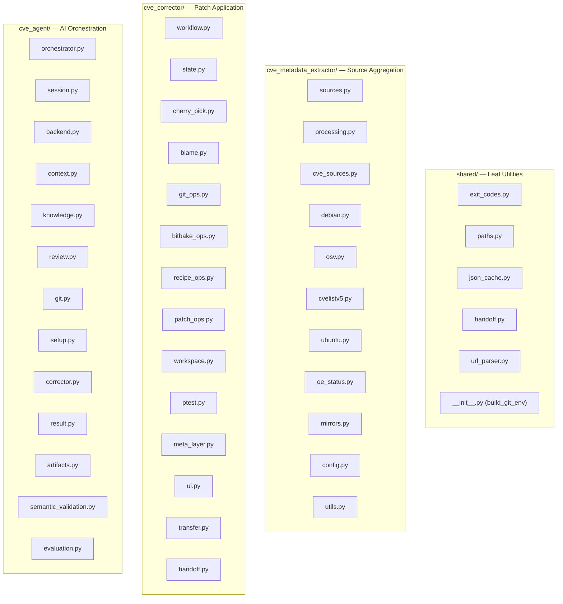

# Components

## Package Map

## shared/

| File | Responsibility |
|------|---------------|
| `exit_codes.py` | Single source of truth for all exit codes (0–16) |
| `paths.py` | XDG-compliant `data_dir()` and `cache_dir()` with env overrides |
| `json_cache.py` | Gzip-compressed JSON cache with atomic writes (`cache_load`, `cache_dump`) |
| `handoff.py` | Versioned corrector-to-agent repository state and scope contract |
| `url_parser.py` | Structure-aware commit-URL parsing (GitHub/GitLab, cgit, gitweb, Gitiles, kernel.org shortlinks, Pagure, SourceForge, Fossil), extract hashes, fetch PR commit lists. `HASH_RE` is shared and intentionally unanchored — `cve_metadata_extractor/debian.py` scans free-text notes with `findall()` |
| `__init__.py` | `GIT_ENV_ALLOWLIST` and `build_git_env()` for safe subprocess environments |

## cve_metadata_extractor/

| File | Responsibility |
|------|---------------|
| `sources.py` | `CveSource` base class, `SOURCE_REGISTRY`, plugin auto-discovery |
| `processing.py` | `process_cve()` — orchestrates extraction across all enabled sources |
| `cve_sources.py` | `load_cves_from_sources()` — reads cve-summary.json or VEX input |
| `debian.py` | Debian Security Tracker: DSA parsing, patch extraction from .debian.tar |
| `osv.py` | OSV API: query by CVE, extract fix commits and references |
| `cvelistv5.py` | CVEList V5 + NVD: local git clone, JSON parsing, reference extraction |
| `ubuntu.py` | Ubuntu Security API: CVE lookup, patch URL extraction |
| `oe_status.py` | Check if CVE is already fixed in OE branches (git log search) |
| `mirrors.py` | Create/update local git mirrors of upstream source repos |
| `config.py` | Load config.json with XDG path resolution and caching |
| `utils.py` | Shared utilities: hash regex, PR cache, deduplication, URL patterns |
| `__main__.py` | CLI entry point: argument parsing, batch processing, summary output |

## cve_corrector/

| File | Responsibility |
|------|---------------|
| `workflow.py` | Main state machine: `initialize_cve_workflow()`, `finish_cve_workflow()`, build/ptest steps |
| `state.py` | `WorkflowState` dataclass, exception hierarchy, state persistence |
| `cherry_pick.py` | Cherry-pick strategies: single commit, series, least-conflict selection |
| `blame.py` | `git blame` analysis to determine if CVE is applicable to recipe version |
| `git_ops.py` | Git operations: checkout, tag matching, monorepo detection, strip level |
| `bitbake_ops.py` | BitBake integration: meta-layer resolution, mirror lookup, workspace cleanup |
| `recipe_ops.py` | Recipe file manipulation: SRC_URI patching, bbappend handling, patch naming |
| `patch_ops.py` | Patch file operations: metadata insertion, patch modification |
| `workspace.py` | devtool workspace setup: `setup_devtool_workspace()`, upstream remote, CVE branch |
| `ptest.py` | ptest execution: enable ptest, run tests, compare before/after results |
| `meta_layer.py` | Meta-layer commit creation: CVE status writing, patch export |
| `ui.py` | Terminal UI: conflict/edit/manual instruction display |
| `transfer.py` | Verified cross-layout commit mapping, adaptation, and rollback |
| `handoff.py` | Produce the trusted corrector-to-agent repository manifest |
| `__main__.py` | CLI entry point: argument parsing, bitbake env validation, interrupt handling |
| `version.py` | PEP 440-compatible version comparison for tag matching |

## cve_agent/

| File | Responsibility |
|------|---------------|
| `orchestrator.py` | Resolution loop: run corrector → evaluate exit → spawn AI → retry |
| `session.py` | Guarded AI sessions: scope enforcement, audit logging, deviation tracking |
| `backend.py` | `AIBackend` interface, one-preamble instruction assembly, lazy built-in registration, plugin discovery |
| `kiro_backend.py` | Default `kiro-cli` backend implementation |
| `claude_backend.py` | Claude Code CLI backend implementation |
| `openai_backend.py` | Native configuration plus guarded client/runtime/transcript session integration |
| `openai_client.py` | Bounded non-streaming Chat Completions transport, retries, redaction, and protocol response types |
| `openai_loop.py` | Multi-turn message/tool-call state machine, independent bounds, progress policy, and protected JSONL transcript |
| `openai_redaction.py` | Shared bearer/configured-secret redaction for diagnostics, transcripts, and trusted terminal text |
| `openai_tools.py` | Typed schemas, path policy, bounded file inspection/mutation tools, and build-relevant mutation generation |
| `openai_git_tools.py` | Closed Git schemas, bounded executor, parsed inspection, exact staging/commit/amend, cherry-pick preflight, and trusted provenance |
| `openai_deadline.py` | Injectable monotonic session deadline and distinct runtime timeout error |
| `openai_host_tools.py` | Interactive approval, controlled `devtool build`, protected artifacts, and host-verified `finish` outcomes |
| `openai_provider.py` | Provider capability schema and bounded stable failure taxonomy/evidence |
| `openai_probe.py` | Source-free opt-in provider conformance probe |
| `openai_ollama.py` | Bounded native Ollama alias preparation, preload, and context verification |
| `openai_profile.py` | Strict named-profile parsing, validation, and fallback selection |
| `openai_preflight.py` | Bounded repository initialization and precise pre-provider diagnostics |
| `openai_progress.py` | Host-evidence progress digests and no-progress accounting |
| `artifacts.py` | Per-attempt restrictive manifests, redacted transcript, summaries, and telemetry |
| `handoff.py` | Validation and activation of the corrector's trusted repository handoff |
| `result.py` | Versioned workflow, build, security, and failure outcomes |
| `semantic_validation.py` | Reference/generated diff evidence and independent security-status decision |
| `evaluation.py` | Immutable campaign manifests, fresh-snapshot execution, metrics, and deterministic reports |
| `context.py` | Build AI prompt context: conflict details, build logs, ptest results, knowledge |
| `knowledge.py` | `KnowledgeBase` class: store/retrieve resolution patterns with file-locking |
| `review.py` | Post-resolution review: diff display, commit amendment, approval workflow |
| `git.py` | Agent-specific git ops: scope hook, unauthorized change revert, env filtering |
| `setup.py` | Agent installation: verify kiro-cli, install agent definitions |
| `corrector.py` | Thin wrapper: validate inputs, invoke `cve_corrector` subprocess |
| `__init__.py` | Package constants: `AgentConfig`, `CveResult`, `ResultStatus`, exit code re-exports |
| `AGENT_INSTRUCTIONS.md` | Backend-neutral prompt template; CLI shell examples and native typed-tool/conclusion precedence |
| `agents/*.json` | kiro-cli agent definition files (interactive and non-interactive) |

## extra/

Plugin directory (`.gitignore`'d). Contains symlinks to private plugins. Auto-discovered at runtime by both extractor (`CveSource`) and agent (`AIBackend`).

## tests/

| Directory | Coverage |
|-----------|----------|
| `tests/agent/` | Orchestration, session, backend, context, knowledge, review, git, security |
| `tests/agent/test_openai_compatibility.py` | CLI/env/docs/instruction/Ollama-shape compatibility contract |
| `tests/agent/test_openai_protocol_integration.py` | Disposable socket-to-runtime success/failure, authority, cleanup, and redaction flows |
| `tests/integration/test_evaluation.py` | Offline campaign, provenance, comparison, resume, and deterministic-report gate |
| `tests/agent/test_openai_live.py` | Explicitly opted-in disposable Ollama read/finish smoke; skipped by default |
| `tests/corrector/` | Workflow, cherry-pick, blame, git ops, recipe ops, state, ptest, monorepo |
| `tests/extractor/` | Each source (debian, osv, cvelistv5, ubuntu), processing, utils |
| `tests/shared/` | URL parser, conftest fixtures |
| `tests/integration/` | Shell-based end-to-end tests with real git repos |
| `tests/conftest.py` | Shared fixtures: mock bitbake env, workspace/repo factories |
| `tests/helpers.py` | Test utilities: workflow runner, patch assertion helpers |

Native-backend coverage is split by boundary: `test_openai_backend.py`
(configuration/CLI), `test_openai_client.py` (portable HTTP schema),
`test_openai_tools.py` and `test_openai_git_tools.py` (typed host policy),
`test_openai_host_tools.py` (build/approval/finish), `test_openai_loop.py`
(conversation/transcript state machine), `test_openai_backend_loop.py` (real
runtime integration), `test_openai_protocol_integration.py` (real HTTP plus
typed runtime and Git flows), and `test_openai_compatibility.py` (Ollama UX,
instructions, and documentation). `test_openai_live.py` is skipped unless the
operator explicitly sets `CVE_AGENT_LIVE_OPENAI_TEST=1`; it creates a
disposable repository and requires a read-only tool/finish flow.
