# Data Models

## Core Dataclasses

### WorkflowState (cve_corrector/state.py)

Serializable state for the corrector's workflow, enabling resume after interruption.

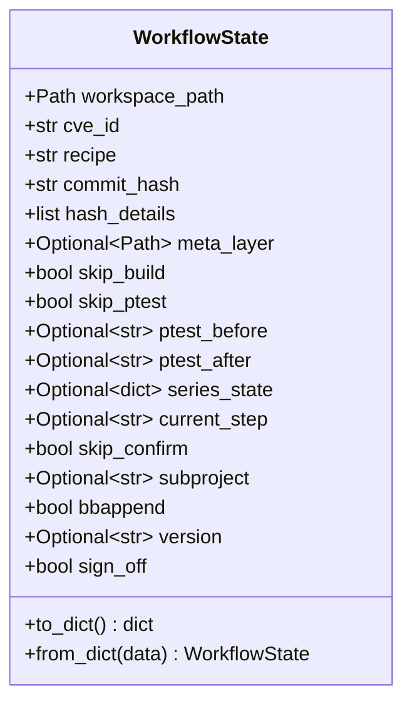

**Persistence**: JSON file at `<state_dir>/<recipe>.json`, written atomically via `tempfile` + `os.replace`.

### AgentConfig (cve_agent/__init__.py)

Configuration for a single CVE agent run.

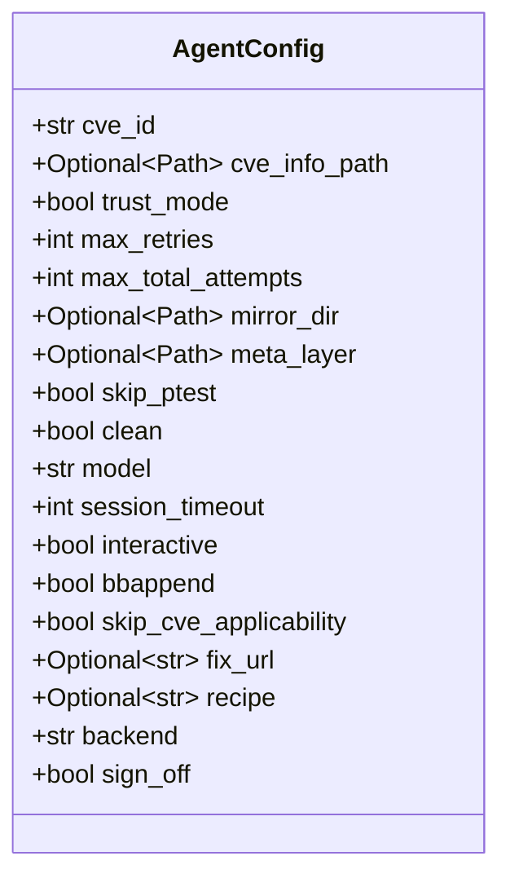

### CveResult (cve_agent/__init__.py)

Outcome of processing a single CVE.

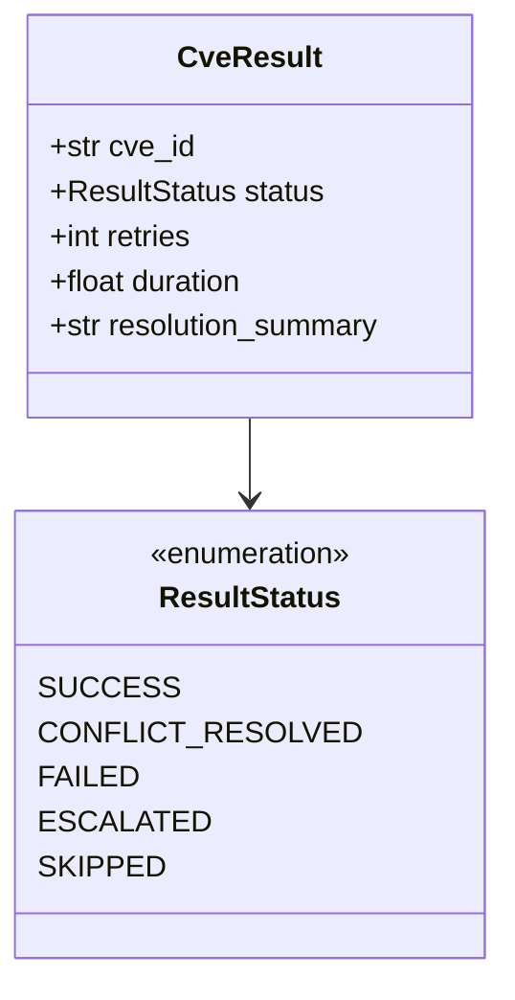

### ResolutionPattern (cve_agent/knowledge.py)

A recorded conflict resolution pattern for the knowledge base.

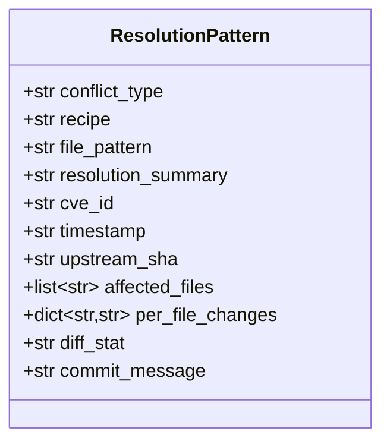

### SessionResult (cve_agent/backend.py)

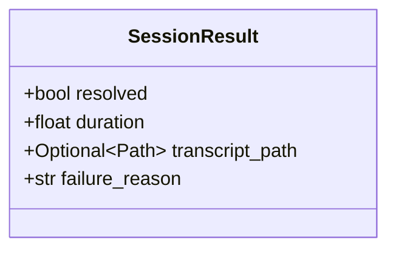

### OpenAIConfig (cve_agent/openai_backend.py)

Immutable, validated configuration for the native OpenAI-compatible backend.
It stores the name of an API-key environment variable, never the key value.

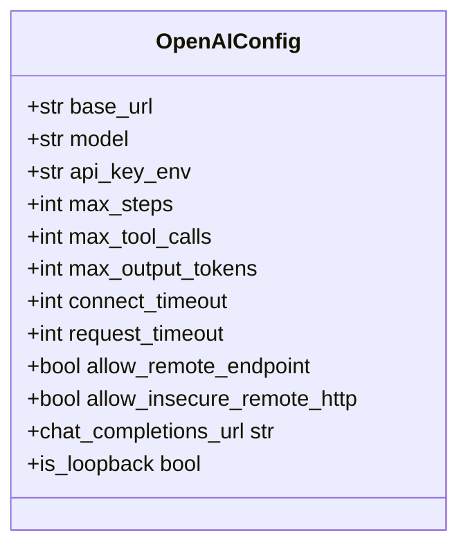

### FileToolLimits and ToolResult (cve_agent/openai_tools.py)

`FileToolLimits` is an immutable per-session set of size/count limits capped
by module-level hard maxima. `ToolResult` is the bounded JSON-serializable
outcome of a host-side tool call; `terminal` is always false until a later
model-loop stage calls the host runtime's verified `finish` tool.

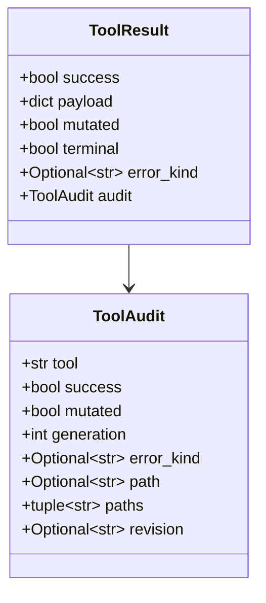

The internal `_ExecutionResult.advances_generation` flag defaults true for
durable source/index mutations. Typed commit/amend results remain
`mutated=True` for audit and loop-progress purposes but set it false because
they only record source content validated by the preceding build.

### GitToolLimits and RepositorySnapshot (cve_agent/openai_git_tools.py)

`GitToolLimits` caps revisions, path counts, parsed log/status entries,
subprocess output, diagnostics, resolution notes, and per-command duration;
typed replacement/follow-up commit messages have a separate 16 KiB byte cap.
`RepositorySnapshot` retains the session-start commit and operation markers
for later terminal-state checks without changing `guarded_session()`.

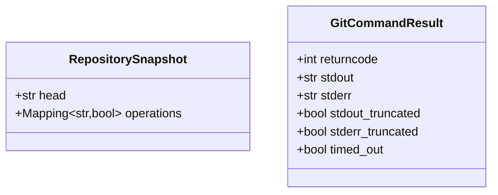

### Native host runtime models (cve_agent/openai_deadline.py, openai_host_tools.py)

`SessionDeadline` stores one absolute monotonic expiry shared by Git, build,
approval, terminal checks, and the future HTTP loop. `BuildCommandResult`
keeps only a bounded output tail in memory while naming the bounded trusted
log. `ApprovalDecision` is closed to `approve_once`, `approve_class`, `deny`,
and `timeout`.

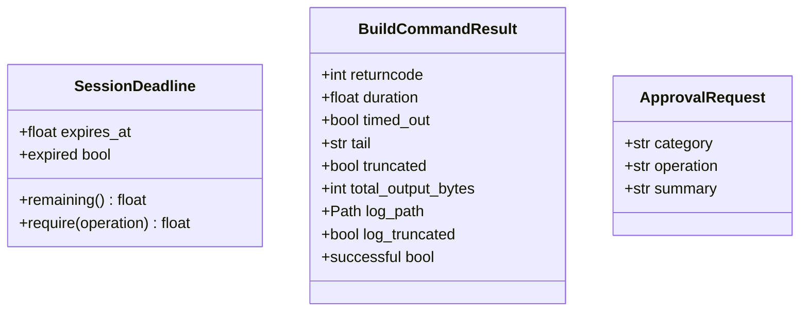

### WorkflowConfig (cve_corrector/workflow.py)

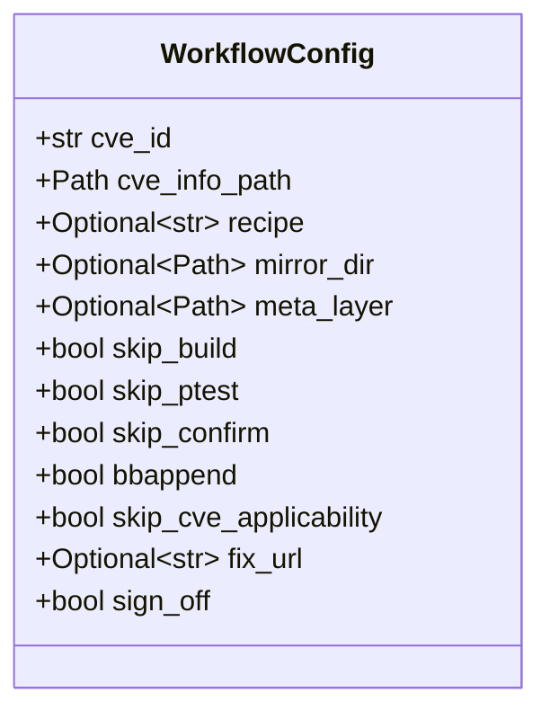

## Enumerations

### ResultStatus (cve_agent/__init__.py)

| Value | Meaning |
|-------|---------|
| `SUCCESS` | CVE fixed on first attempt (clean cherry-pick) |
| `CONFLICT_RESOLVED` | Fixed after AI-assisted conflict resolution |
| `FAILED` | All retries exhausted |
| `ESCALATED` | Unrecoverable error, requires human intervention |
| `SKIPPED` | CVE already applied or not applicable |

### Exit Codes (shared/exit_codes.py)

| Code | Constant | Category | Meaning |
|------|----------|----------|---------|
| 0 | `EXIT_SUCCESS` | Success | Workflow completed |
| 1 | `EXIT_CONFLICT` | Recoverable | Cherry-pick conflict |
| 2 | `EXIT_CHECKOUT_ERROR` | Unrecoverable | Version checkout failed |
| 3 | `EXIT_PTEST_ERROR` | Recoverable | Post-patch ptest failure |
| 4 | `EXIT_BUILD_ERROR` | Recoverable | Post-patch build failure |
| 5 | `EXIT_PATCH_ERROR` | Unrecoverable | Patch generation error |
| 6 | `EXIT_METADATA_ERROR` | Unrecoverable | Bad metadata/config |
| 7 | `EXIT_GIT_ERROR` | Unrecoverable | Git operation failed |
| 8 | `EXIT_PTEST_PREEXISTING` | Unrecoverable | Ptest already failing |
| 9 | `EXIT_DEVTOOL_ERROR` | Unrecoverable | Devtool operation failed |
| 10 | `EXIT_BUILD_PREEXISTING` | Unrecoverable | Build already failing |
| 11 | `EXIT_ALREADY_APPLIED` | Unrecoverable | Fix already present |
| 12 | `EXIT_NOT_APPLICABLE` | Unrecoverable | Vulnerable code absent |
| 13 | `EXIT_TRUST_DECLINED` | Agent | User declined trust mode |
| 14 | `EXIT_AGENT_ERROR` | Agent | Internal agent error |
| 15 | `EXIT_AI_TIMEOUT` | Agent | AI session timed out |
| 16 | `EXIT_IGNORED_BY_STATUS` | Unrecoverable | Recipe's CVE_STATUS marks CVE as Ignored/Patched |

## Exception Hierarchy

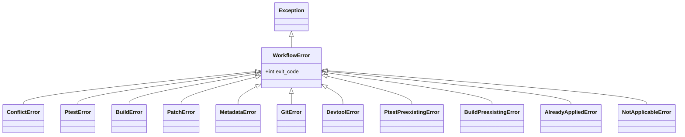

Each exception maps to a specific exit code. The corrector's `__main__.py` catches `WorkflowError` and returns `e.exit_code`.

## JSON Schemas

### cve-metadata.json

Top-level dict keyed by CVE ID:

```json
{
  "CVE-YYYY-NNNN": {
    "name": "string (component/recipe name)",
    "hashes": ["string (commit SHA)"],
    "hash_details": [
      {"hash": "string", "url": "string", "source": "string"}
    ],
    "series": [
      {"pull_url": "string", "commits": ["string"]}
    ],
    "patches": [
      {"url": "string", "tags": "string"}
    ],
    "references": ["string (URL)"],
    "oe_status": "string (optional, e.g. 'fixed-in-scarthgap')"
  }
}
```

### Native Chat Completions models (cve_agent/openai_client.py)

The single-exchange client returns only immutable validated response data.
Function arguments remain bounded JSON text for the later dispatcher; an
`arguments_were_object` flag records the Ollama-style object compatibility
accommodation. `OpenAIClientLimits` caps 128 messages, 64 tools/calls, a 1 MiB
request, a 1 MiB decoded response, 128/64 KiB response headers, depth 32, and
20,000 JSON nodes by default.

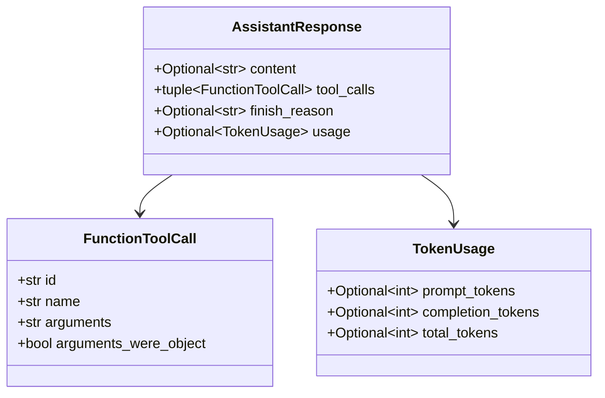

### Native agent loop models (cve_agent/openai_loop.py)

`AgentLoopLimits` independently caps model turns, total calls, calls per
assistant response (16 by default), and consecutive nonprogress responses
(three by default). `JSONLTranscript` is a mandatory mode-`0600` audit stream;
`TranscriptError` fails the session closed. The loop continues to return the
existing `SessionResult`, setting `resolved` only from the trusted runtime's
accepted terminal state and always returning the transcript path when it was
created. Unresolved native results also return a stable, credential-free
`failure_reason` suitable for CLI display; resolved results leave it empty.

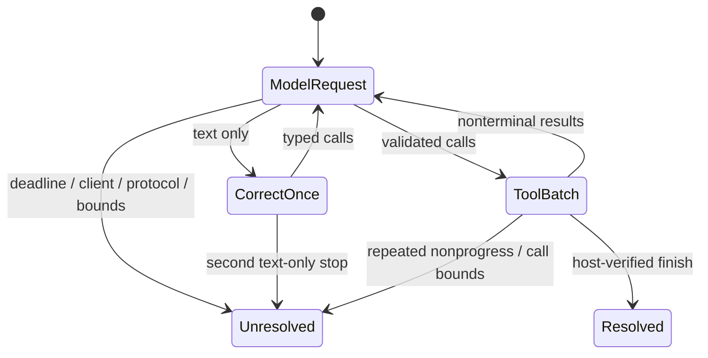

### knowledge.json

Array of `ResolutionPattern` objects (see dataclass above). File-locked with `fcntl.flock` for concurrent access safety.

### conclusion.json (Agent Outcome)

Legacy CLI backends write this outcome under their existing permissions. The
native OpenAI host runtime denies generic file-tool access and writes the file
atomically only after `finish` verifies a clean baseline state. The two exact
orchestrator-compatible forms are:

```json
{
  "not_applicable": true,
  "reason": "string (specific explanation)"
}
```

```json
{
  "needs_human": true,
  "reason": "string (specific explanation)"
}
```

### config.json (Extractor Configuration)

```json
{
  "cvelistv5_url": "string (git URL)",
  "cvelistv5_branch": "string",
  "debian_release": "string",
  "debian_tracker_url": "string (git URL)",
  "debian_tracker_branch": "string",
  "nvd_url": "string (git URL)",
  "nvd_branch": "string",
  "oe_branches": ["string"],
  "osv_api": "string (base URL)",
  "ubuntu_api": "string (base URL)",
  "snapshot_api": "string (base URL)"
}
```
