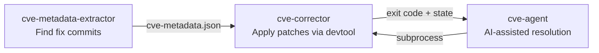

<!-- SPDX-License-Identifier: MIT -->
# yocto-security-tools

[](https://github.com/Ericsson/yocto-security-tools/actions/workflows/ci.yml)
[](https://www.bestpractices.dev/projects/13578)
[](https://scorecard.dev/viewer/?uri=github.com/Ericsson/yocto-security-tools)
[](https://pypi.org/project/yocto-security-tools/)
[](https://pypi.org/project/yocto-security-tools/)
[](https://pepy.tech/project/yocto-security-tools)
[](https://github.com/astral-sh/ruff)
[](https://mypy-lang.org/)
[](https://github.com/Ericsson/yocto-security-tools/blob/main/LICENSE)

Standalone CVE management tools for Yocto/OpenEmbedded Linux distributions.

Agent result files separate workflow completion, current build evidence, and
security validation. A successful agent/build workflow is reported as
`WORKFLOW_COMPLETED_UNVERIFIED` until a trusted semantic validation phase
accepts it; see [the versioned result schema](docs/result-schema.md). Every
attempt also has a [durable, redacted artifact directory](docs/agent-artifacts.md)
created before [typed repository preflight](docs/agent-preflight.md).

## Tools

| Tool | Purpose |
|------|---------|
| **cve-metadata-extractor** | Find fix commits for CVEs from multiple public sources (Debian, OSV, CVEList V5, Ubuntu CVE Tracker, NVD) |
| **cve-corrector** | Automate backporting CVE fixes to Yocto recipes using devtool |
| **cve-agent** | Orchestrate CVE backporting with AI-assisted conflict resolution |

Recoverable corrector failures cross a validated, versioned repository-state
boundary before an AI backend starts. See
[Corrector-to-agent repository handoff](docs/corrector-agent-handoff.md) for
the manifest, generated-file policy, and explicit merge-mainline handling.
Cross-layout changes use a [deterministic patch-transfer plan](docs/safe-patch-transfer.md)
with content anchors, rollback, and exact path verification.
Completed builds pass through a host-owned
[semantic security validation gate](docs/semantic-security-validation.md)
before they are accepted for release.
Native model sessions use [state-based progress accounting and bounded
terminal budgets](docs/agent-progress-and-budgets.md) instead of trusting model
prose or call IDs as evidence of progress.

## Requirements

- Python 3.9+
- Git
- For `cve-corrector` / `cve-agent`: a sourced Yocto build environment (`BBPATH` set)
- For `cve-agent`: [kiro-cli](https://github.com/kirodotdev/Kiro) (default), [Claude Code](https://code.claude.com) (`--backend claude`), a tool-capable OpenAI-compatible model endpoint (`--backend openai` or `openai-<profile>`), or a custom backend plugin
- Optional, for `cve-agent`: [`patchutils`](https://cyberelk.net/tim/software/patchutils/) (provides `interdiff`) — when installed, cve-agent enriches its review diff, console output, and AI context with a concise upstream-vs-backport adaptation delta. When absent, cve-agent falls back to its existing behavior unchanged.

## Installation

### From PyPI

```bash
pip install yocto-security-tools
```

### From source (development)

```bash
git clone https://github.com/Ericsson/yocto-security-tools.git
cd yocto-security-tools
pip install -e .
```

## Quick Start

### Find CVE fix metadata

```bash
# From Yocto cve-summary.json (output of sbom-cve-check)
cve-metadata-extractor --yocto-summary cve-summary.json --output cve-metadata.json

# For a specific CVE
cve-metadata-extractor --cve-id CVE-2024-1234 --cve-component-name openssl
```

### Apply CVE patches

```bash
# Source your Yocto build environment first
source oe-init-build-env

# Apply a CVE fix
cve-corrector --cve-id CVE-2024-1234 --cve-info cve-metadata.json

# Resume after manual conflict resolution
cve-corrector --continue
```

**Dependent commit chains.** `--fix-url` is repeatable. A single URL applies
one fix commit (or one pull request's commits); two or more URLs are treated
as one ordered, dependent chain — the caller controls the order, and **all**
commits must apply or the run stops at a conflict (no falling back to
applying just one of them). Use this when a CVE is fixed by a short series
of follow-up commits on the same branch, e.g. acl's CVE-2026-XXXXX:

```bash
cve-corrector --cve-id CVE-2026-XXXXX --recipe acl \
  --fix-url https://cgit.git.savannah.nongnu.org/cgit/acl.git/commit/?id=5906d2868ec8d3b08be556153696e6b1122eeeda \
  --fix-url https://cgit.git.savannah.nongnu.org/cgit/acl.git/commit/?id=0071c6d1fea0a8a6270333baa85fb609be325c26 \
  --fix-url https://cgit.git.savannah.nongnu.org/cgit/acl.git/commit/?id=170dbd3beff9bd5bdab3f72db1a04bf282f6087c
```

If the chain conflicts partway through, resolve it and resume with
`cve-corrector --continue` — the remaining commits are applied in the same
order. `cve-agent` accepts the same repeated `--fix-url` flag and forwards
it unchanged to `cve-corrector`.

### AI-assisted backporting

```bash
# Uses kiro-cli by default; Claude Code and native OpenAI-compatible modes are available
cve-agent --cve-id CVE-2024-1234 --cve-info cve-metadata.json --trust

# Batch mode
cve-agent --cve-list cves.txt --cve-info cve-metadata.json --trust

# Use the Claude Code backend (install and authenticate the `claude` CLI first)
cve-agent --cve-id CVE-2024-1234 --cve-info cve-metadata.json --backend claude --model sonnet

# Use a custom backend plugin from extra/
cve-agent --cve-id CVE-2024-1234 --cve-info cve-metadata.json --backend my_backend

# Disable the knowledge base for this run (no similar-pattern lookups, no
# pattern saved on success) -- useful for benchmarking a model's unaided
# performance
cve-agent --cve-id CVE-2024-1234 --cve-info cve-metadata.json --trust --no-knowledge
```

**AI backends.** `kiro` (default) drives [kiro-cli](https://github.com/kirodotdev/Kiro);
`claude` drives the [Claude Code](https://code.claude.com) `claude` CLI directly.
The Claude Code backend needs a recent `claude` on `PATH`, already authenticated
(Anthropic API key, or Bedrock/Vertex), supporting `-p`, `--permission-mode`,
`--allowedTools`/`--disallowedTools`, `--append-system-prompt`, and `--add-dir`.
Pass `--model sonnet|opus|haiku` (or a full model id); the default
`claude-sonnet-5` is mapped to `sonnet`. Both backends run under the same
file-scope guard, so the AI can only modify the files the upstream fix touches.

### Native OpenAI-compatible backend and Ollama

The built-in `openai` backend directly calls a non-streaming
`/chat/completions` endpoint and runs the agent loop and closed typed tools
inside this project. It does not invoke another agent CLI and exposes no
generic shell. Local Ollama is supported without an API key when the selected
model reliably supports function tools:

```bash
export CVE_AGENT_OPENAI_MODEL='replace-with-a-tool-capable-model'
export CVE_AGENT_OPENAI_BASE_URL='http://127.0.0.1:11434/v1'
cve-agent --backend openai --cve-id CVE-2024-1234 --cve-info /absolute/path/to/cve-metadata.json
```

Named profiles keep a validated endpoint/model policy in
`etc/openai-<profile>.cfg` and still use the canonical native `openai` backend:

```bash
cve-agent --backend openai-site-model --cve-id CVE-2024-1234 --cve-info /absolute/path/to/cve-metadata.json
```

Set `CVE_AGENT_OPENAI_CONFIG_DIR` to an absolute directory to use site-local
profiles. Profiles use a strict INI schema, may select portable Chat
Completions sampling fields, and may opt into bounded Ollama alias preparation
before source or build data is sent to the model endpoint. Remote plain HTTP
still requires both explicit endpoint opt-ins.

Profiles may also declare a strict versioned `[capabilities]` dialect and an
opt-in source-free `[probe]`. A primary profile can name one different native
profile in `[fallback]`; only model/provider-addressable failures are eligible,
while both attempts retain the same deadline, counters, trusted Git state, and
allowed-file scope. Timeout and rate-limit fallback are separately opt-in.

See the [native OpenAI-compatible backend guide](docs/openai-compatible-backend.md)
for the Ollama setup, exact API contract, configuration precedence, key and
remote-endpoint gates, interactive approvals, transcript location, limitations,
and troubleshooting.

For backend/model campaigns, use the security-first
[reproducible evaluation harness](docs/evaluation-harness.md). It enforces
fresh identical snapshots, immutable same-campaign resume, complete crossover
cohorts, baseline-health exclusions, decomposed telemetry, and semantic—not
legacy union—success metrics.

Before a controlled evaluation release, run the
[adversarial release gate](docs/adversarial-release-gate.md). It maps the
report-derived false positives and hostile model/provider/repository cases to
offline deterministic tests. Passing this gate does not make build success a
security proof or remove mandatory semantic and human review.

## How It Works



Each tool works independently. Chain them via `--cve-info cve-metadata.json`.

## Supported Input Formats

| Format | Flag | Description |
|--------|------|-------------|
| cve-summary.json | `--yocto-summary` | Output from Yocto's `sbom-cve-check` class |
| Direct CVE ID | `--cve-id` | One or more CVE identifiers |
| CVE list file | `--cve-list` | Text file with one CVE ID per line (agent only) |

## Configuration

The extractor reads configuration from `cve_metadata_extractor/config.json` by default.
Override with the `CVE_EXTRACTOR_CONFIG` environment variable.

### Storage (XDG Compliant)

| Directory | Default | Override |
|-----------|---------|----------|
| Persistent data | `~/.local/share/yocto-security-tools/` | `CVE_TOOLS_DATA_DIR` |
| Cache (expendable) | `~/.cache/yocto-security-tools/` | `CVE_TOOLS_CACHE_DIR` |

### Config Keys

| Key | Default | Description |
|-----|---------|-------------|
| `cvelistv5_url` | GitHub | Git URL to clone CVEList V5 from |
| `debian_tracker_url` | salsa.debian.org | Git URL for Debian tracker |
| `nvd_url` | GitHub | Git URL for NVD data |
| `uct_url` | git.launchpad.net | Git URL to clone the Ubuntu CVE Tracker from |
| `uct_branch` | `master` | Branch to track for the Ubuntu CVE Tracker clone |
| `oe_branches` | `["scarthgap"]` | OE branches to check for fix status |

### Ubuntu Sources

By default, Ubuntu CVE data comes from a local clone of the
[Ubuntu CVE Tracker](https://git.launchpad.net/ubuntu-cve-tracker) (`--uct-dir`,
default under the shared data directory). The clone is shallow but still
sizeable (tens of thousands of CVE records) — expect the first run to take a
while to fetch. Disable with `--no-uct`.

The legacy Ubuntu Security API source (one HTTP request per CVE to
`ubuntu.com`) is **deprecated and disabled by default**, since it gets
rate-limited on batch runs. It is slated for removal; use `--ubuntu-api` to
re-enable it for comparison. `--no-ubuntu` is accepted but is now a no-op
(it warns and does nothing, since the API source is already off by default).

## Environment Variables

| Variable | Purpose |
|----------|---------|
| `CVE_EXTRACTOR_CONFIG` | Override config.json path |
| `CVE_TOOLS_DATA_DIR` | Override XDG data directory |
| `CVE_TOOLS_CACHE_DIR` | Override XDG cache directory |
| `GITHUB_TOKEN` | GitHub API access (required for PR metadata) |
| `OPENEMBEDDED_TOKEN` | OE mailing list API |
| `BBPATH` | Required for cve-corrector/cve-agent (Yocto build env) |
| `CVE_EXTRA_SOURCES_DIR` | Override plugin directory for extractor |
| `CVE_EXTRA_BACKENDS_DIR` | Override plugin directory for agent backends |

## Plugin System

Add custom CVE data sources or AI backends by dropping `.py` files in the `extra/` directory. See [extra/README.md](extra/README.md) for the plugin development guide.

### Quick Example: Custom Source

```python
# extra/my_source.py
from cve_metadata_extractor.sources import CveSource, SOURCE_REGISTRY

class MySource(CveSource):
    name = 'my_source'
    def is_enabled(self, args): return True
    def extract(self, cve_id, stats): return [], [], [], []

SOURCE_REGISTRY.append(MySource())
```

## Development

```bash
python3 -m venv venv
source venv/bin/activate
pip install -e ".[dev]"
pytest
```

See [CONTRIBUTING.md](CONTRIBUTING.md) for full development guidelines.

## License

MIT — see [LICENSE](LICENSE)
