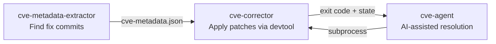

<!-- SPDX-License-Identifier: MIT -->
# yocto-security-tools

[](https://github.com/Ericsson/yocto-security-tools/actions/workflows/ci.yml)
[](https://www.bestpractices.dev/projects/13578)
[](https://scorecard.dev/viewer/?uri=github.com/Ericsson/yocto-security-tools)
[](https://pypi.org/project/yocto-security-tools/)
[](https://github.com/Ericsson/yocto-security-tools/blob/main/LICENSE)

CVE management tools for Yocto/OpenEmbedded Linux distributions. They find the
upstream commits that fix a CVE, apply them to your recipes, and optionally use
an AI backend to resolve the conflicts and build failures that follow.

## How it works



Each tool works standalone. Chain them with `--cve-info cve-metadata.json`.

## Requirements

- Python 3.10+ and Git
- A sourced Yocto build environment (`BBPATH` set) for `cve-corrector` and
  `cve-agent`
- An AI backend for `cve-agent` — see [Modules](#modules) below

## Installation

```bash
pip install yocto-security-tools
```

From source:

```bash
git clone https://github.com/Ericsson/yocto-security-tools.git
cd yocto-security-tools
pip install -e .
```

## Quick start

```bash
# 1. Find fix commits for the CVEs in a Yocto CVE summary
cve-metadata-extractor --yocto-summary cve-summary.json --output cve-metadata.json

# 2. Source your Yocto build environment
source oe-init-build-env

# 3. Apply one fix
cve-corrector --cve-id CVE-2024-1234 --cve-info cve-metadata.json

# ...or let an AI backend resolve conflicts and build failures for you
cve-agent --cve-id CVE-2024-1234 --cve-info cve-metadata.json
```

## Modules

### cve-metadata-extractor

Finds the commits that fix a CVE by querying Debian security-tracker, OSV,
CVEList V5, the Ubuntu CVE Tracker, and NVD, then writes a single
`cve-metadata.json` for the other two tools. Accepts a Yocto `cve-summary.json`
(`--yocto-summary`) or explicit CVE IDs (`--cve-id`). Optionally checks whether
a fix already landed in an OpenEmbedded branch (`--check-oe`).

→ [Full reference](docs/cve-metadata-extractor.md)

### cve-corrector

Applies a fix to a recipe using `devtool`: cherry-picks the upstream commit into
the recipe's source tree, builds, runs ptest, and finishes the change into a
layer. Stops with a specific exit code when it needs help — conflict, build
failure, or ptest failure — so you can fix it by hand and resume with
`--continue`. `--fix-url` is repeatable and applies two or more commits as one
ordered, dependent chain.

→ [Full reference](docs/cve-corrector.md)

### cve-agent

Runs `cve-corrector` as a subprocess and, on a recoverable exit code, starts a
guarded AI session to resolve the conflict or failure, then retries. Backends
are interchangeable via `--backend`:

| Backend | `--backend` | Needs |
|---------|-------------|-------|
| Kiro CLI | `kiro` (default) | [kiro-cli](https://github.com/kirodotdev/Kiro) |
| Claude Code | `claude` | Authenticated [`claude` CLI](https://code.claude.com) on `PATH` |
| Native OpenAI-compatible | `openai` / `openai-<profile>` | A tool-capable OpenAI-compatible endpoint, including local Ollama |
| Custom plugin | your own name | A file in `extra/` implementing `AIBackend` |

Every backend runs under the same file-scope guard, so the AI can only modify
the files the upstream fix touches. Check a backend is installed and responding
with `cve-agent --backend <name> --verify-backend`. Use `--cve-list` for batch
runs.

→ [Full reference](docs/cve-agent.md) ·
[OpenAI-compatible/Ollama setup](docs/openai-compatible-backend.md)

## Documentation

[docs/README.md](docs/README.md) indexes everything: per-tool references,
configuration, and the design docs covering the result schema, agent artifacts,
preflight checks, the corrector-to-agent handoff, safe patch transfer, semantic
security validation, and the evaluation harness.

## Plugins

Add a CVE data source or an AI backend by dropping a `.py` file into `extra/` —
no existing file needs to change. See
[extra/README.md](extra/README.md) for the plugin guide.

## Configuration

Data and cache directories follow the XDG base directory spec and are
overridable, as are the extractor's config path and the API tokens. See
[docs/configuration.md](docs/configuration.md).

## Development

```bash
python3 -m venv venv
source venv/bin/activate
pip install -e ".[dev]"
pytest
```

See [CONTRIBUTING.md](CONTRIBUTING.md) for full development guidelines.

## License

MIT — see [LICENSE](LICENSE)
